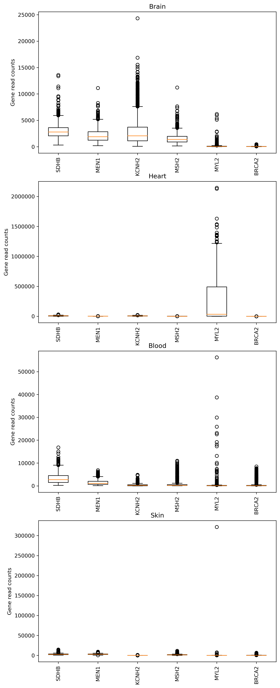

# Workflow using Snakemake

## Input data
* https://github.com/swe4s/lectures/blob/master/data_integration/gtex/GTEx_Analysis_2017-06-05_v8_RNASeQCv1.1.9_gene_reads.acmg_59.gct.gz?raw=true
* https://storage.googleapis.com/gtex_analysis_v8/annotations/GTEx_Analysis_v8_Annotations_SampleAttributesDS.txt

## Environment Setup
The package is implemented using `python 3.6`. The wrapper code is used to construct the workflow. The wrapper code is implemented using `Snakemake`. To set up the environment, the user should install the following packages under Conda environment:

```
wget https://repo.anaconda.com/miniconda/Miniconda3-latest-Linux-x86_64.sh
bash Miniconda3-latest-Linux-x86_64.sh -b
. /home/travis/miniconda3/etc/profile.d/conda.sh
conda update --yes conda
conda config --add channels r
conda create --yes -n test
conda activate test
conda install -y pycodestyle
conda install --yes python=3.6
conda install matplotlib --yes
conda install -y -c bioconda snakemake
```
## Usage
After successful installation, to run the snakemake workflow using conda environment, run:
```
snakemake --use-conda
```
The workflow will proceed with following steps:
1. Get sample IDs corresponding to the specified tissue types and save them in a separate file.
2. Get gene counts for the specific gene and save them in a separate file.
3. Finally, making box plot of the expression levels of those genes across different tissue types.

The program processes the samples to generate count files for specific tissue and genes. These files were then used for summarization of those gene expression levels across different tissue types. The resulting plot is shown below:

